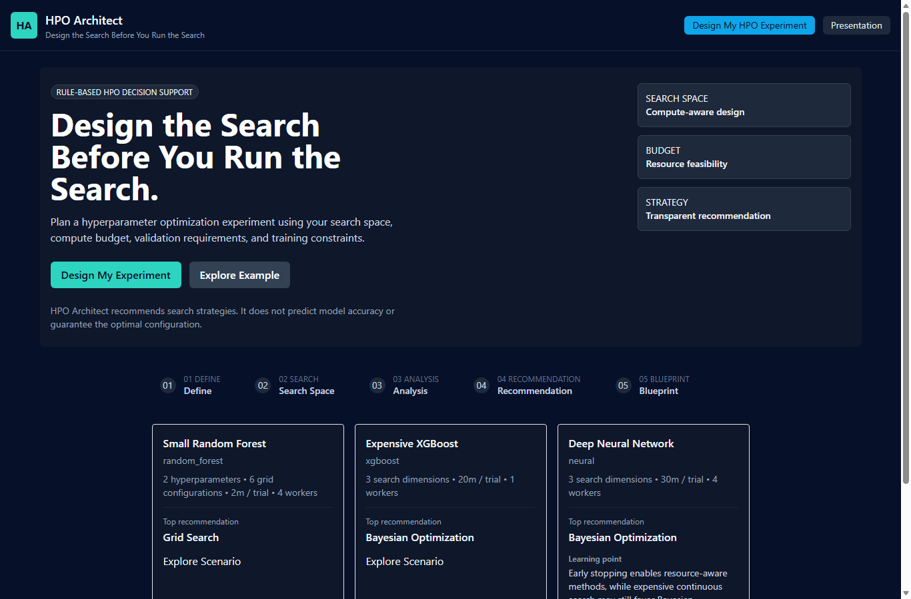
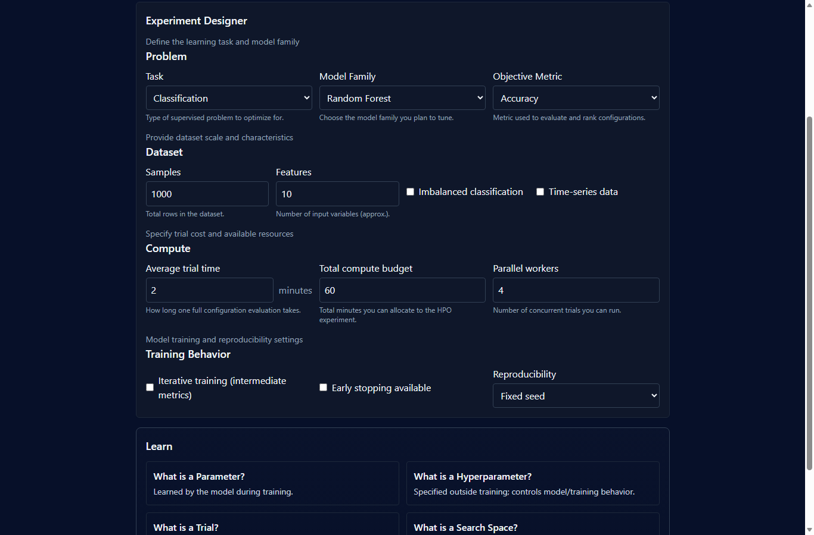
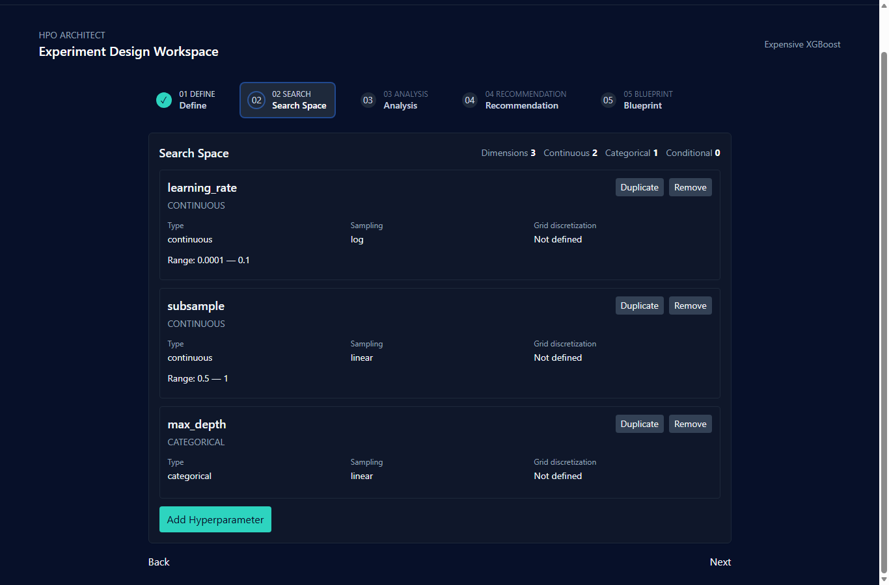
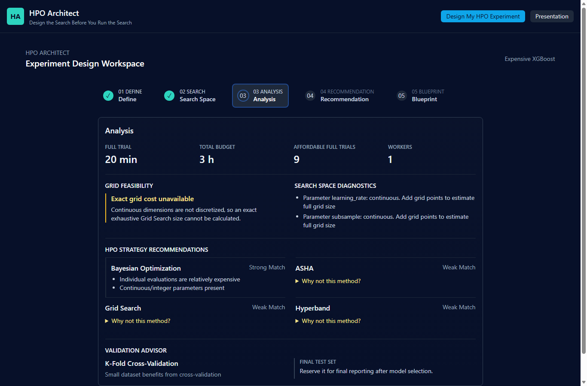
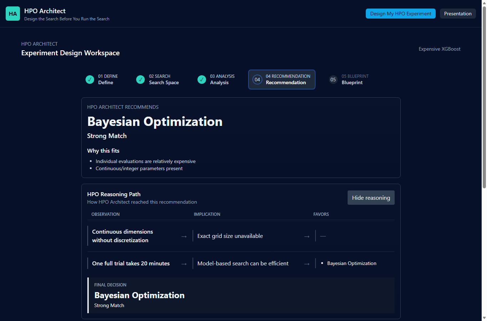
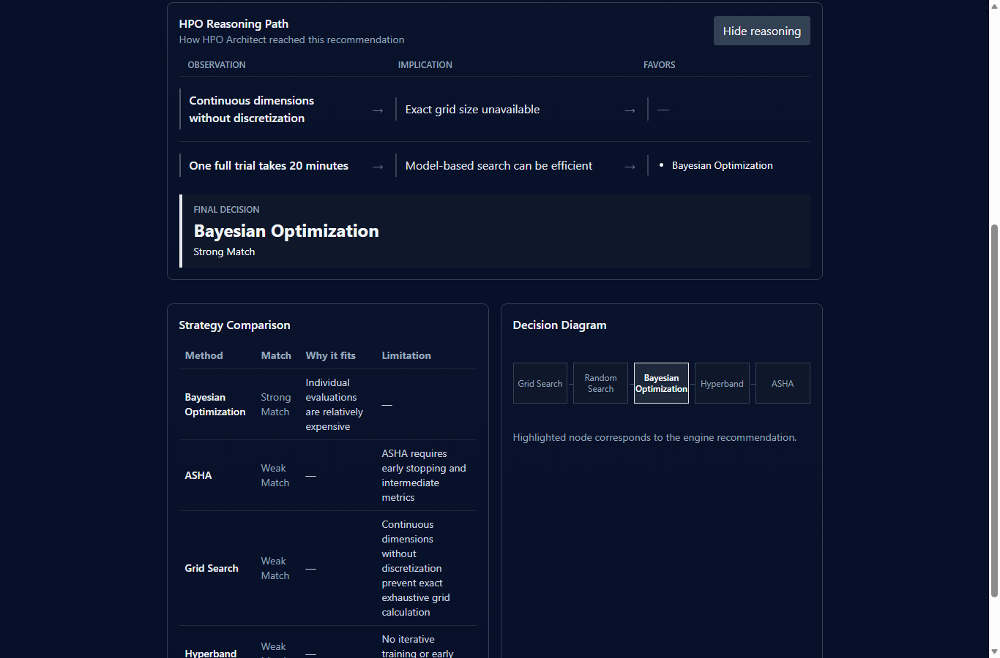
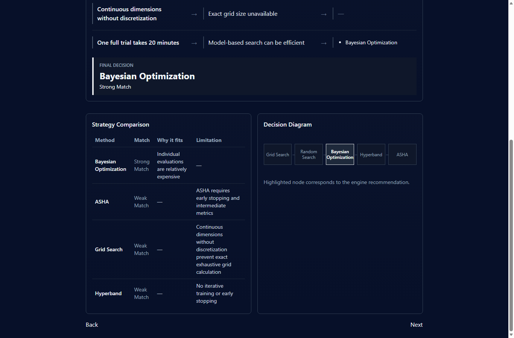
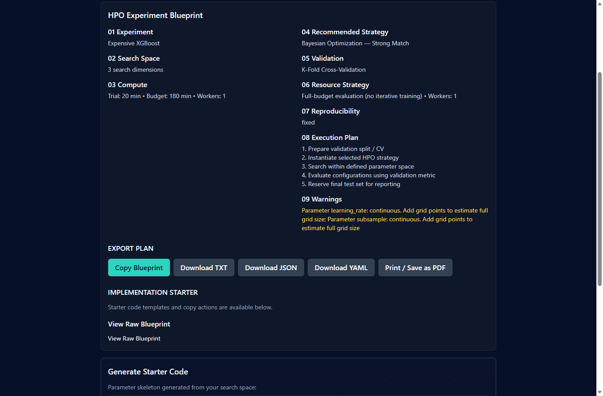
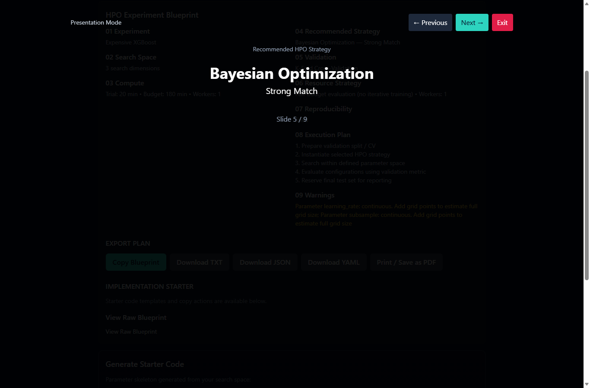
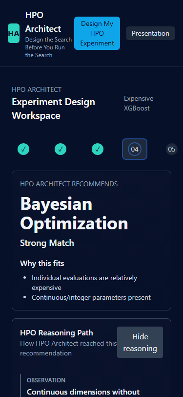

# HPO Architect

### Design the Search Before You Run the Search

HPO Architect is a rule-based decision-support tool for designing scientifically sound hyperparameter optimization experiments before compute resources are spent.

It evaluates:

- search-space structure
- trial cost
- compute budget
- parallel resources
- iterative training behavior
- early-stopping capability
- validation requirements

It then recommends an appropriate HPO strategy with transparent reasoning.



## Why HPO Architect?

Hyperparameter optimization is not only about choosing an algorithm. The appropriate strategy depends on the number and type of hyperparameters, whether the search space is finite or continuous, the cost of one trial, available compute, parallelism, early stopping, and validation design.

HPO Architect helps design the search before running the search. It is a rule-based decision-support system, not a machine-learning model and not an AI performance predictor. It does not predict model accuracy or guarantee an optimal configuration.

## Core Workflow

### 01 — Define

Define the ML task, model family, objective metric, dataset characteristics, compute budget, and training behavior.



### 02 — Search Space

Represent continuous, integer, discrete, categorical, and conditional parameters. Continuous dimensions retain their linear or logarithmic sampling scale, while Grid Search requires explicit discretization before an exact exhaustive size can be calculated.



### 03 — Analyze

HPO Architect evaluates:

- full-trial cost and affordable trial count
- exhaustive Grid Search feasibility
- search-space diagnostics
- validation strategy
- compute and parallel-resource constraints



### 04 — Decide

The system ranks applicable HPO strategies and reports the recommended method, suitability, reasons it fits, limitations, and alternatives.



## Transparent HPO Reasoning

HPO Architect exposes the explicit rules that produced each recommendation:

**Observation → Implication → Favored Strategy → Final Decision**

The reasoning path renders the actual decision trace generated by the analysis engine. Recommendations come from explicit rule-based analysis rather than hidden model predictions.



## Strategy Comparison

The current engine evaluates these strategy categories when their requirements apply:

- Grid Search
- Random Search
- Bayesian Optimization
- Successive Halving
- Hyperband
- ASHA
- Bayesian + Multi-Fidelity
- BOHB

Suitability is relative to the experiment definition. A method may be a strong choice in one compute and search-space regime and a weak choice in another.



## HPO Experiment Blueprint

The final stage creates a structured experiment plan containing:

1. Experiment
2. Search Space
3. Compute
4. Recommended Strategy
5. Validation
6. Resource Strategy
7. Reproducibility
8. Execution Plan
9. Warnings

Blueprints can be copied or exported as TXT, JSON, or YAML, and can be printed or saved as PDF from the browser.



## Implementation Starter

The application provides starter templates for the current search workflows:

- scikit-learn `GridSearchCV`
- scikit-learn `RandomizedSearchCV`
- Optuna optimization
- Optuna pruning / multi-fidelity optimization

Generated code is a starter template and must be adapted to the user's model, dataset, objective function, validation pipeline, and runtime environment. The templates are not production-ready implementations.

## Educational Scenarios

### Small Random Forest

- 2 hyperparameters
- 6 Grid configurations
- 2 min per trial
- 4 workers
- Expected recommendation: **Grid Search**

> “When exhaustive search is cheap, simplicity can win.”

### Expensive XGBoost

- 3 search dimensions
- 20 min per trial
- 1 worker
- continuous search dimensions
- Expected recommendation: **Bayesian Optimization**

> “When model evaluations become expensive, adaptive search becomes more valuable.”

### Deep Neural Network

- 3 search dimensions
- 30 min per trial
- 4 workers
- iterative training
- early stopping
- Expected recommendation: **Bayesian Optimization**

> “Early stopping enables resource-aware methods, while expensive continuous search may still favor Bayesian Optimization.”

Hyperband and Bayesian + Multi-Fidelity remain strong alternatives because intermediate metrics and early stopping are available.

## Validation Integrity

- Hyperparameters must be selected using validation data rather than the final test set.
- The final test set should remain untouched during HPO and be used after model selection for final reporting.
- Time-series problems require time-aware, forward-chaining validation.
- Imbalanced classification may require stratified validation.
- Smaller datasets may benefit from cross-validation, while large and expensive workloads may use a hold-out validation design.
- Repeated tuning against the same validation data can cause validation overfitting.

The advisor recommends a validation structure from the experiment metadata; users remain responsible for leakage prevention and domain-specific evaluation design.

## Training Optimizer vs HPO Strategy

| | Training optimizer | HPO strategy |
|---|---|---|
| Examples | SGD, Adam, AdamW | Grid Search, Bayesian Optimization, Hyperband |
| Selects or updates | Model parameters | Hyperparameters |
| Typical targets | Weights and biases | Learning rate, batch size, depth, dropout |
| Operates | During one model-training run | Across multiple model configurations |

Training optimizers and HPO strategies solve different problems and should not be used interchangeably.

## Presentation Mode

Presentation Mode provides a simplified classroom and demonstration view with larger typography and focused slides for:

- experiment summary
- search space and compute analysis
- Grid feasibility
- recommendation
- reasoning path
- decision diagram
- strategy comparison
- blueprint summary

Keyboard controls:

- `←` Previous
- `→` Next
- `Esc` Exit



## Responsive Design

HPO Architect supports desktop, tablet, and mobile layouts.



## Technology Stack

- React
- TypeScript
- Vite
- Tailwind CSS
- Recharts

The application is frontend-only and stores saved experiments in browser `localStorage`.

## Running Locally

```bash
git clone <repository-url>
cd HPO
npm install
npm run dev
```

Create and inspect a production build with:

```bash
npm run build
npm run preview
```

## Vercel Deployment

HPO Architect is a static Vite application and does not require a backend service.

- Framework preset: `Vite`
- Build command: `npm run build`
- Output directory: `dist`

Connect the repository to Vercel and deploy using those settings. `node_modules/`, generated build output, environment files, logs, and editor artifacts are excluded from Git.
